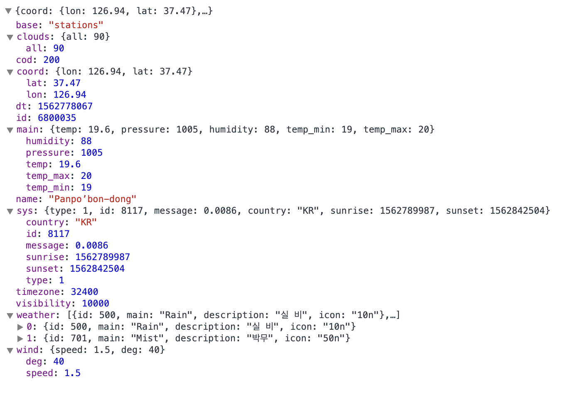
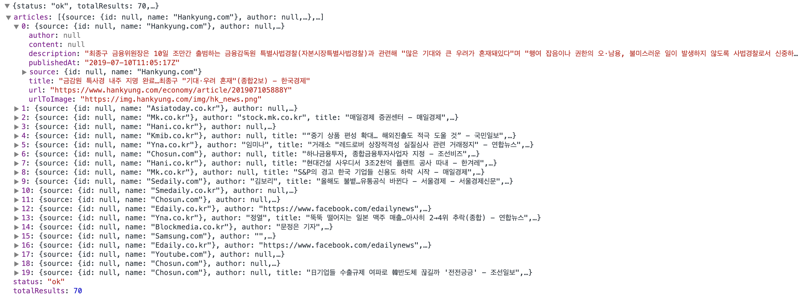
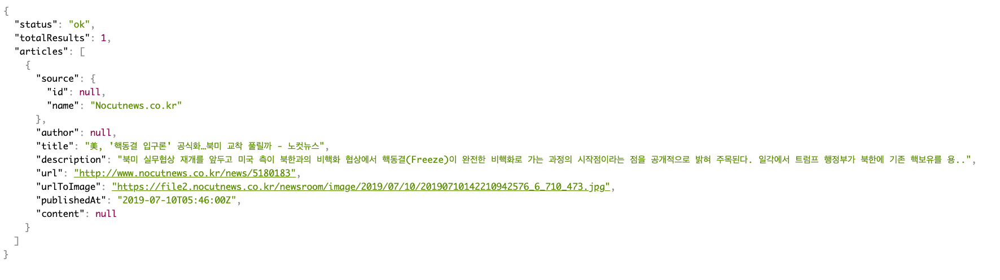

# TodaysNews
  이 APP은 OpenWeatherMap , News 두 api 를 사용해 사용자가 오늘의 날씨와 뉴스를 볼수 있는
 APP입니다.

#### OpenWeatherMap API
##### API 호출방식
- 사용자 위치기반 날씨 요청 ( Get ) : https://api.openweathermap.org/data/2.5/weather?lat=latitude&lon=logitude&appid=APPID

서버 응답(Json)

  [Sample URL](https://samples.openweathermap.org/data/2.5/weather?lat=35&lon=139&appid=b6907d289e10d714a6e88b30761fae22)

#### News API
  ##### API 호출방식
  - 카테고리별 뉴스 요청 ( Get ) : https://newsapi.org/v2/top-headlines?country=kr&category=category&apiKey=apiKey

  서버 응답(Json)

  

  [Sample URL( 카테고리 : business )](https://newsapi.org/v2/top-headlines?country=kr&category=business&apiKey=ec4c02f7e056430bb7cc71878bca7a01)

  - 키워드 검색 요청 ( Get ) : https://newsapi.org/v2/top-headlines?country=kr&q=키워드&apiKey=apiKey

  서버 응답(Json, 검색 키워드 = "북한" )

  

  [Sample URL( 키워드 : 북한 )](https://newsapi.org/v2/top-headlines?country=kr&q=%EB%B6%81%ED%95%9C&apiKey=ec4c02f7e056430bb7cc71878bca7a01)

### library  
    - 사용자 인증
         Firebase Google Authentication , Firebase Email Authentication
        (이메일 로그인, 구글 로그인(Firebase와 통합하기 위해 gms-service-auth 라이브러리 추가))

    - API 호출
        Retrofit (OpenWeather API 와 News API 호출하기 위해 사용)

    - 이미지 로딩 라이브러리
        Glide (서버에서 보내주는 이미지를 보여주기 위해 사용 )

    - API
        OpenWeatherAPI ( 날씨 정보 OpenWeatherMap API : https://openweathermap.org/ )
        NewsAPI ( 뉴스 정보 News API : https://newsapi.org/ )

### 어플 시연 영상

