# TodaysNews
--------
  ## 1. 개요

    오늘의 날씨 와 뉴스를 조회 할 수 있는 Android 어플 "오늘의 날씨" 입니다.

  ## 2. 개발 환경

  - OS : Mac Mojave(version : 10.14.5)
  - 개발언어 : Kotlin(version : 1.3.31)
  - Tool : Android Studio(version : 3.4.1)
  - 외부 라이브러리 :

    |  
Tool
 |  
사용 목적
 |  
Version
 |
    |:--------|:--------:|--------:|
    |**firebase-auth / play-services-auth** | 
사용자 인증(이메일 로그인, 구글 로그인) Firebase 인증방식과 통합하기 위해 gms-service-auth 라이브러리 추가 
 |*firebase-auth:16.0.5 / play-services-auth:16.0.1* |
    |**Retrofit2** | 
API 호출(OpenWeather API 와 News API 호출하기 위해 사용)
 |*2.5.0* |
    |**Glide** | 
서버에서 보내주는 이미지를 보여주기 위해 사용
 |*4.9.0* |
    |**Stetho(Facebook)** | 
네트워크 상태를 쉽게 확인하기 위해 사용(Debugging)
 |*1.5.0* |

  - 사용된 API:

      | 
API
 | Web Site |
      |:--------------------:|:--------:|
      |OpenWeatherMap API( 날씨 정보 )| https://openweathermap.org/ |
      |News API( 뉴스 정보 ) | https://newsapi.org/ |

  ### 어플 시연 영상
  

  ## 3.API

 #### OpenWeatherMap API

  - **사용자 위치기반 날씨 요청 ( Get )** : https://api.openweathermap.org/data/2.5/weather?lat=latitude&lon=logitude&appid=APPID

  사용자에게 location(Network Location Provider) 권한을 받고 서버로 현재 사용자의 위도와 경도를 URL 쿼리 파라미터의 값으로 담아 해당 위치의 날씨정보를 요청 한다.  

 **서버 응답 형태 (Json)**

 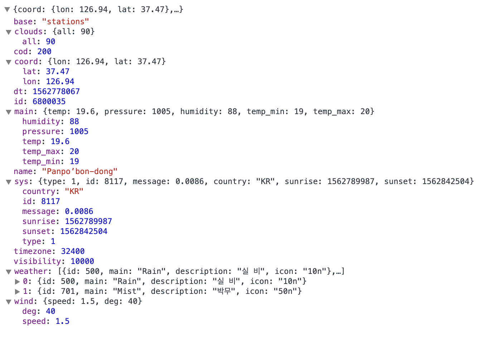

   [Sample URL](https://samples.openweathermap.org/data/2.5/weather?lat=35&lon=139&appid=b6907d289e10d714a6e88b30761fae22)

 #### News API

   - **카테고리별 뉴스 요청( Get )**  : https://newsapi.org/v2/top-headlines?country=kr&category=category&apiKey=apiKey

   URL 쿼리 파라미터의 값으로 기사 category의 값을 담아 서버의 요청을 보내면 해당 category 관련 기사만 서버에서 전송 해준다.

    **서버 응답 형태(Json)**

   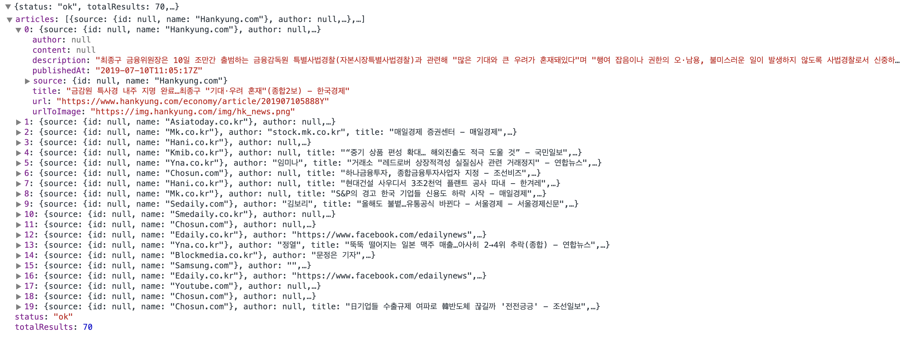

   [Sample URL( 카테고리 : business )](https://newsapi.org/v2/top-headlines?country=kr&category=business&apiKey=ec4c02f7e056430bb7cc71878bca7a01)

   - **키워드 검색 요청 ( Get )** : https://newsapi.org/v2/top-headlines?country=kr&q=키워드&apiKey=apiKey

   URL 쿼리 파라미터의 값으로 키워드 검색을 할 수 있고 서버는 해당 키워드에 맞는
   기사들만 보내준다.

    **서버 응답 형태(Json, 검색 키워드 = "북한" )**

   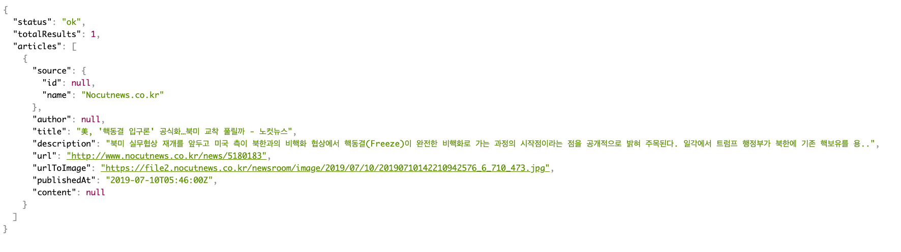

   [Sample URL( 키워드 : 북한 )](https://newsapi.org/v2/top-headlines?country=kr&q=%EB%B6%81%ED%95%9C&apiKey=ec4c02f7e056430bb7cc71878bca7a01)

## 4. Apps View

  #### 1. 사용자 인증

  + **이메일 로그인**

  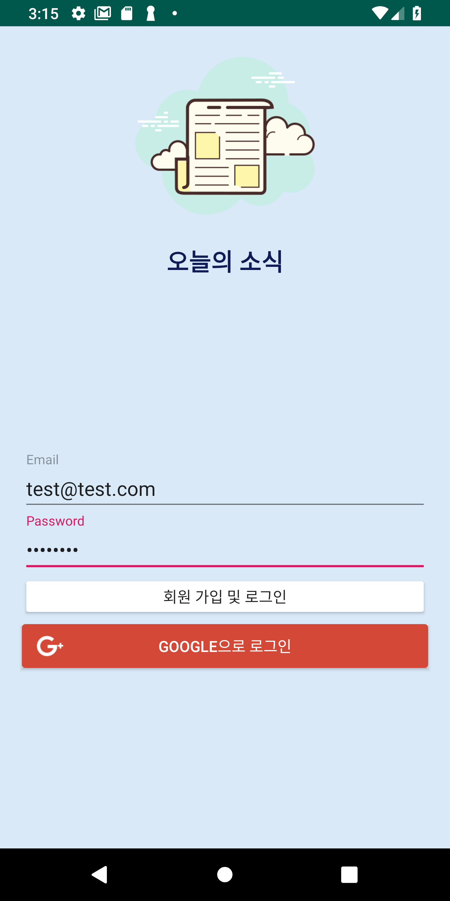</img>

    이메일 주소와 비밀번호로 사용자를 인증하는 방법 해당 계정이 존재하지 않으면 해당 이메일과 비밀번호로 회원가입이 진행된다.

  + **구글 로그인**

  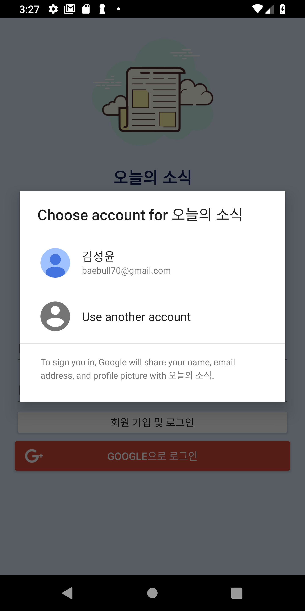</img>

    Google 계정으로 로그인을해 OAuth 토큰을 받아 사용자를 인증하는 방법

  + **계정 관리**

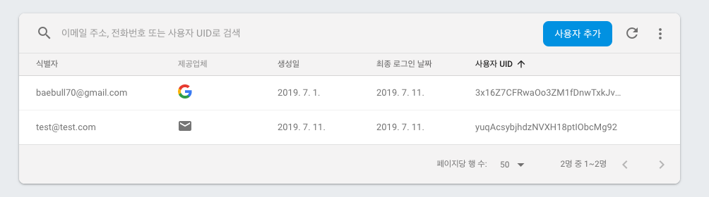

  **Firebase Authentication 계정 관리 페이지**   
    신규회원이 회원가입을 하게 되면 Firebase Authentication에 유저정보가 추가
    되고 인증이 된 사용자를 Firebase console 에서 대쉬보드 형태로 볼수 있다.
    (Firebase 에서 제공 )

  * **로그아웃 / 회원탈퇴**

  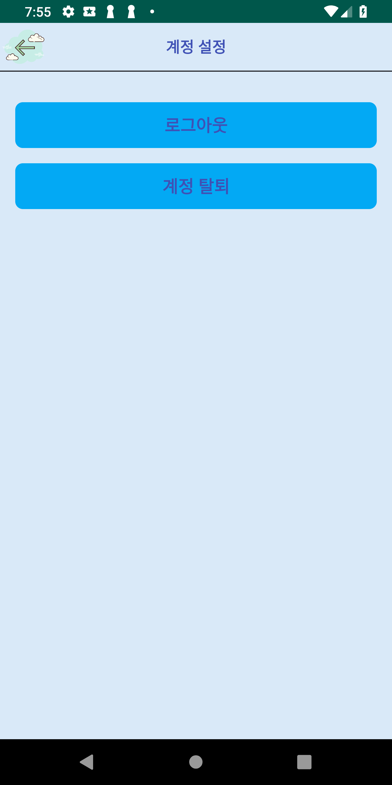</img>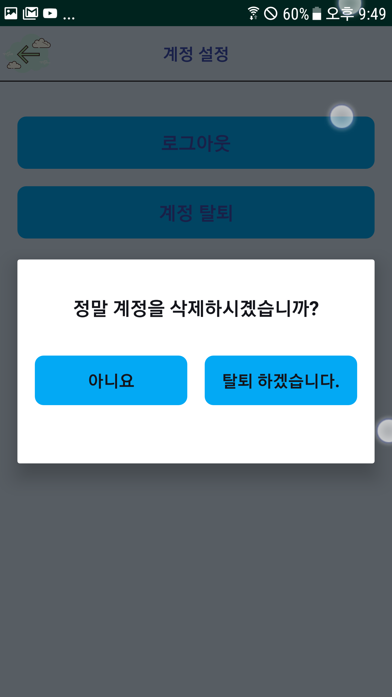</img>

  로그아웃과 회원탈퇴를 진행 할 수 있는 Activity,
  사용자가 회원탈퇴를 하기위해 회원 탈퇴를 진행하면 다이얼로그를 통해서 다시 묻는 과정 이며 로그아웃을 진행할떄는 터치시 바로 로그아웃이 진행된다.

   #### 2. 날씨 조회

   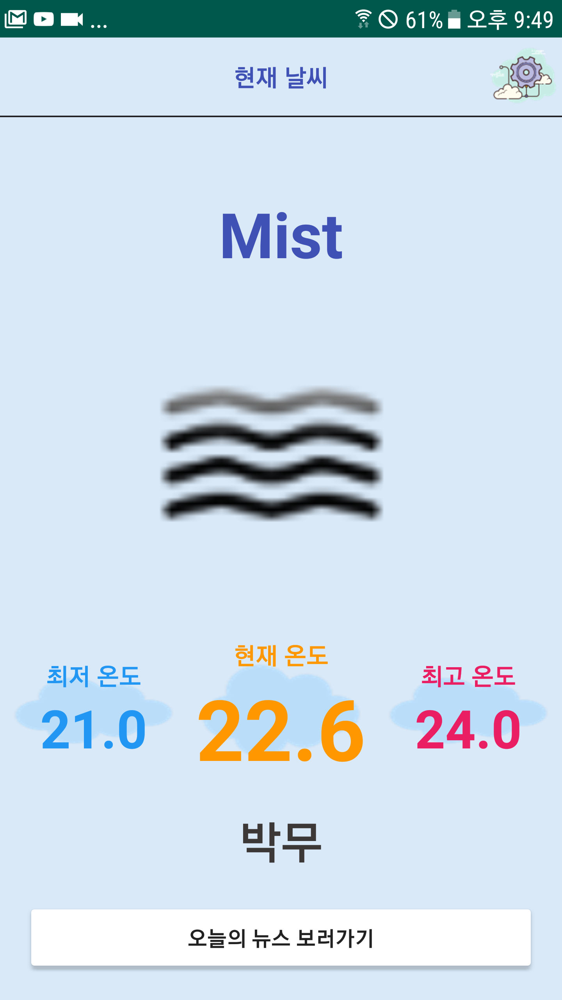</img>

  날씨를 볼수 있는 이 Activity 는 로그인 후 바로 볼수 있는 Main 이며 서버에서
    보내주는 이미지 파일 과 날씨 정보들을 한눈에 볼 수 있게 구성 하였다.
  ( OpenWeatherMapAPI 에서 한글을 지원하지만 정확한 한글을 지원하지는 않는것 같다. )

   #### 3. 뉴스 조회
  - **Main**

   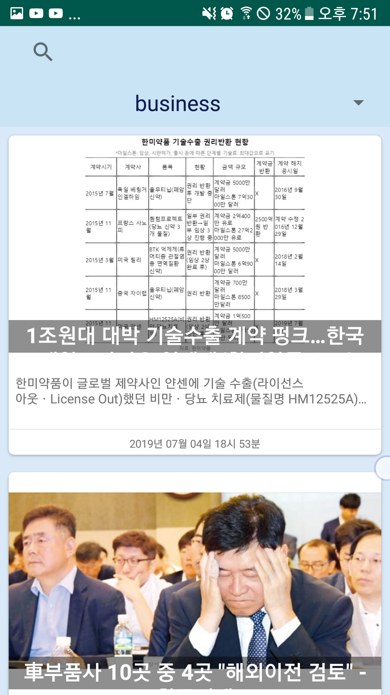</img>

  뉴스를 볼수 있는 Activity 이며 서버에서 보내주는 데이터를 __recyclerView,cardView__ 를 사용하여 뉴스 기사 항목들을 사용자가 접근하기 쉽게 구성 하였다.

  - **카테고리 선택**

    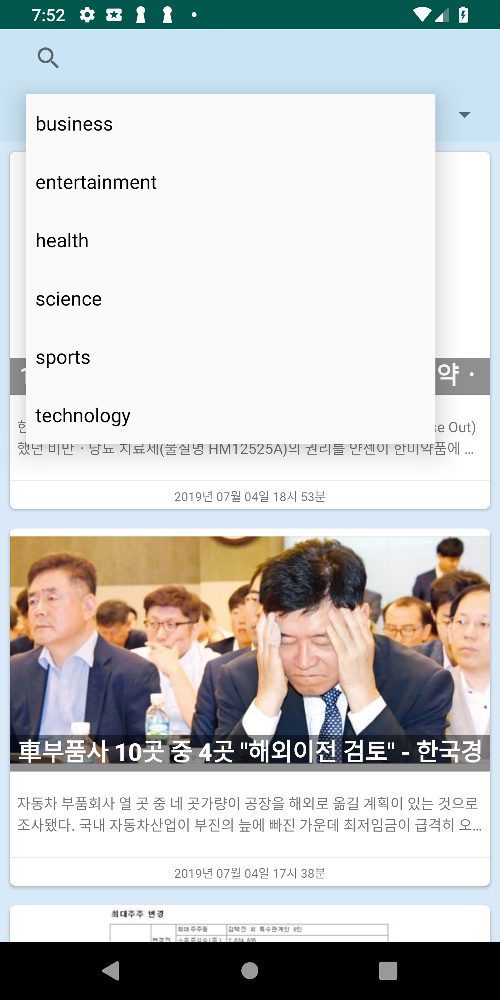</img>

    __Spinner__ 의 아이템을 선택하면 해당 값의 카테고리를 가진 기사들만 가져온다.

  - **키워드 검색**

    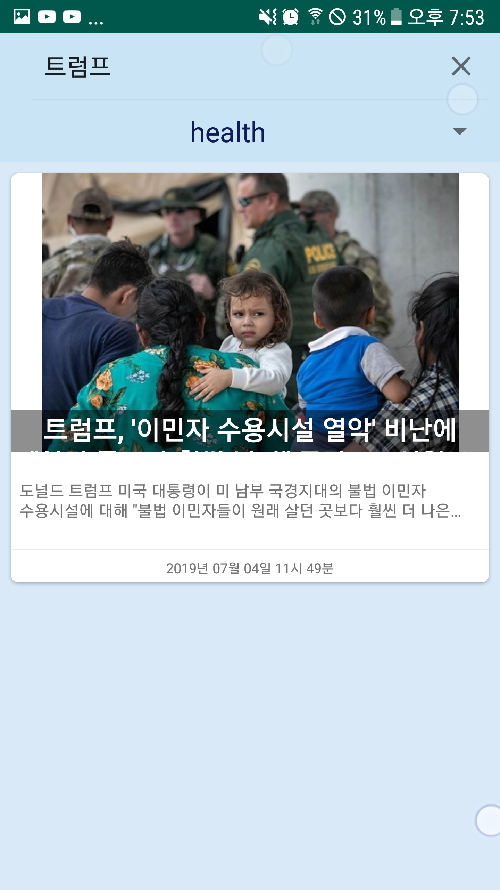</img>

    __SearchView__ 를 사용 하였고, 기사의 키워드를 검색하면 해당 키워드에 맞는 기사를 볼 수 있다.

  - **기사 원문**

   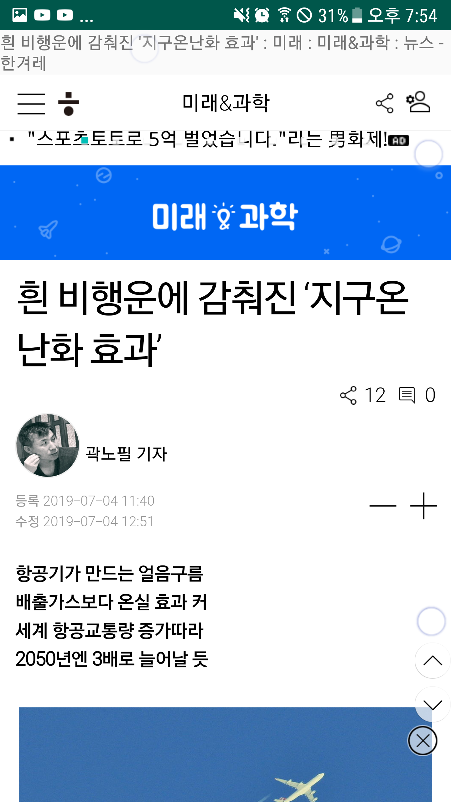</img>

    한개의 기사가 담겨져 있는 __CardView__를 터치하면 기사원문을 볼수 있는 View로 이동한다( WebView 형태로 기사를 볼수 있게 구성 )

  - **새로 고침**

   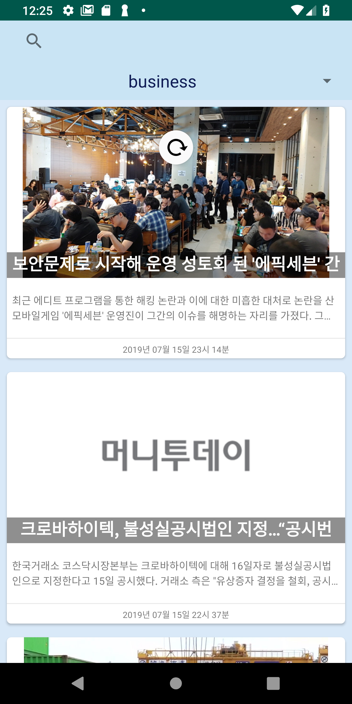</img>

   __SwipeRefreshLayout__ 을 사용하여 상단을 Swipe 할때 새로운 기사를 서버에 요청을 할 수 있다.
   (현재 날짜의 새로운 기사가 있는 경우에만)
